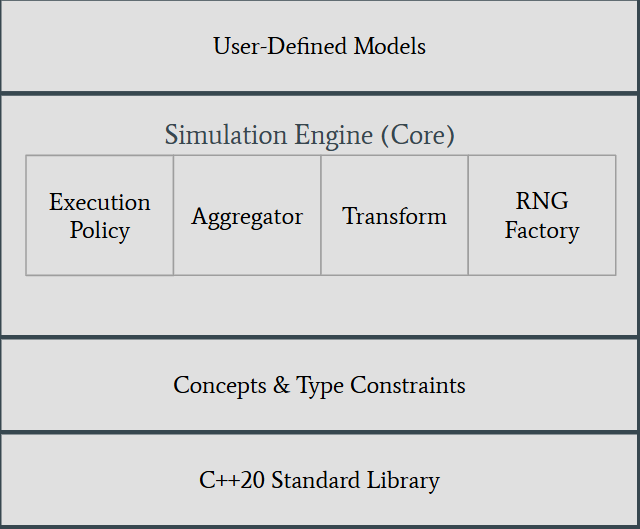
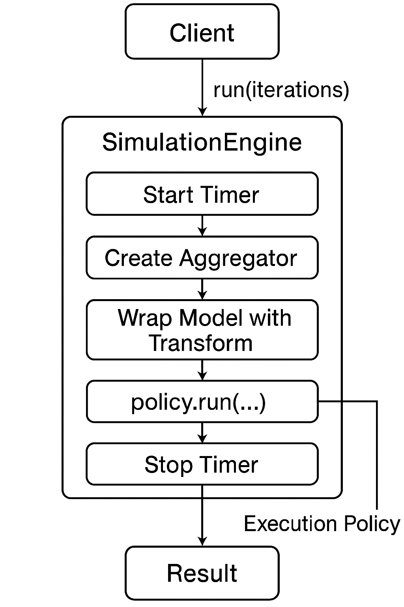
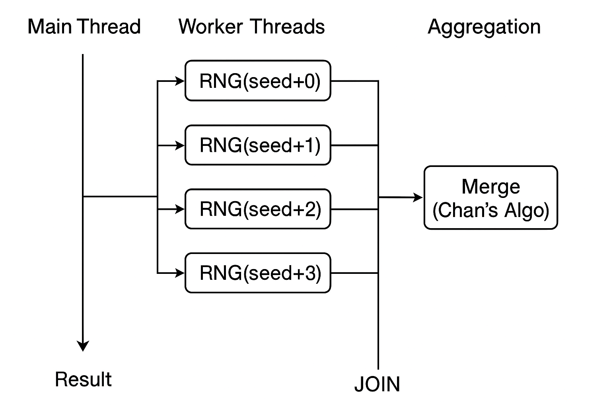
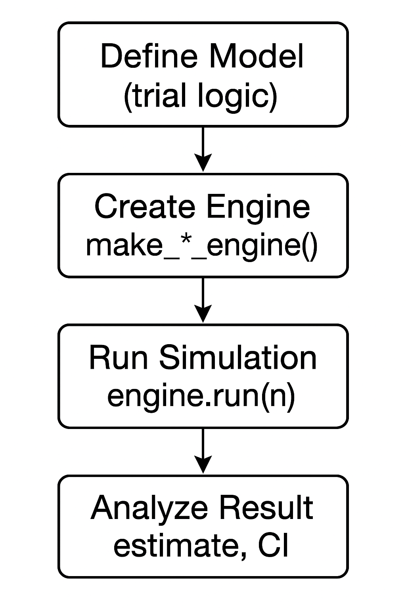

# Design Documentation - MonteCarloSimulator Library

## Table of Contents
- [1. High-Level Overview](#1-high-level-overview)
  - [1.1 Design Philosophy](#11-design-philosophy)
  - [1.2 Architecture Summary](#12-architecture-summary)
  - [1.3 Key Design Goals](#13-key-design-goals)
- [2. Core Components](#2-core-components)
  - [2.1 SimulationEngine](#21-simulationengine)
  - [2.2 Execution Policies](#22-execution-policies)
  - [2.3 Aggregators](#23-aggregators)
  - [2.4 Transforms](#24-transforms)
  - [2.5 Random Number Generation](#25-random-number-generation)
- [3. Concept-Driven Design](#3-concept-driven-design)
  - [3.1 SimulationModel Concept](#31-simulationmodel-concept)
  - [3.2 ResultAggregator Concept](#32-resultaggregator-concept)
  - [3.3 Transform Concept](#33-transform-concept)
  - [3.4 RngFactory Concept](#34-rngfactory-concept)
- [4. Extensibility Points](#4-extensibility-points)
  - [4.1 Custom Models](#41-custom-models)
  - [4.2 Custom Execution Policies](#42-custom-execution-policies)
  - [4.3 Custom Aggregators](#43-custom-aggregators)
  - [4.4 Custom Transforms](#44-custom-transforms)
  - [4.5 Custom RNG Factories](#45-custom-rng-factories)
- [5. Performance Considerations](#5-performance-considerations)
  - [5.1 Parallel Execution Design](#51-parallel-execution-design)
  - [5.2 Memory Layout and Cache Efficiency](#52-memory-layout-and-cache-efficiency)
- [6. Build System Architecture](#6-build-system-architecture)
  - [6.1 CMake Configuration](#61-cmake-configuration)
  - [6.2 Header-Only Design](#62-header-only-design)
  - [6.3 Optional Features](#63-optional-features)
- [7. Error Handling and Safety](#7-error-handling-and-safety)
- [8. Future Extensions](#8-future-extensions)
- [9. Design Patterns](#9-design-patterns)
- [10. Usage Workflows](#10-usage-workflows)

---

## 1. High-Level Overview

### 1.1 Design Philosophy

MonteCarloSimulator is designed around the following core principles:

1. **Zero-Cost Abstractions**: Leverage C++20 features (concepts, templates) to provide compile-time polymorphism with no runtime overhead
2. **Composability**: Each component (model, execution policy, aggregator, transform) is independently configurable and composable
3. **Type Safety**: Use concepts to enforce compile-time constraints on user-provided types
4. **Header-Only**: Simplify integration and enable maximum compiler optimization opportunities
5. **Progressive Disclosure**: Simple use cases require minimal code; advanced features are available when needed

### 1.2 Architecture Summary

The library follows a layered architecture:



The architecture is based on **template parameterization** where the `SimulationEngine` acts as a coordinator between four orthogonal concerns:

- **Model**: Defines the simulation logic (what to compute per trial)
- **Execution Policy**: Defines how trials are executed (sequential, parallel, GPU)
- **Aggregator**: Defines how results are collected and summarized
- **Transform**: Defines post-processing of individual trial results

### 1.3 Key Design Goals

| Goal | Design Decision | Rationale |
|------|----------------|-----------|
| **Performance** | Header-only + templates | Enables inlining and optimization across boundaries |
| **Flexibility** | Policy-based design | Users can customize each dimension independently |
| **Correctness** | Concept constraints | Compile-time validation of user types |
| **Reproducibility** | Explicit seed management | Deterministic results for testing and debugging |
| **Scalability** | Multiple execution policies | From single-threaded to GPU acceleration |

---

## 2. Core Components

### 2.1 SimulationEngine

The `SimulationEngine` is the central orchestrator that coordinates all aspects of a Monte Carlo simulation.

#### Type Signature
```cpp
template<
    typename Model,
    typename Aggregator = WelfordAggregator<>,
    typename ExecutionPolicy = execution::Sequential,
    typename Transform = transform::Identity,
    typename RngFactory = DefaultRngFactory
>
class SimulationEngine;
```

#### Responsibilities

1. **Lifecycle Management**: Owns instances of model, policy, transform, and RNG factory
2. **Timing**: Measures execution time for performance analysis
3. **Result Construction**: Packages aggregated statistics into a `Result` object
4. **Seed Management**: Maintains base seed and passes it to execution policies

#### Key Methods

```cpp
Result run(std::uint64_t iterations) const;
Result simulate(std::uint64_t iterations, std::uint64_t seed) const;
std::uint64_t seed() const noexcept;
void set_seed(std::uint64_t seed) noexcept;
```

#### Design Rationale

- **Template Parameters**: All components are template parameters rather than runtime polymorphism (virtual functions) to enable zero-cost abstraction
- **Const Correctness**: `run()` is const to allow reuse of the same engine instance
- **Seed Override**: `simulate()` allows per-run seed override for convenience while maintaining the base seed



### 2.2 Execution Policies

Execution policies determine **how** trials are executed. They implement a common interface but use static (compile-time) polymorphism.

#### Interface Contract
```cpp
template<typename Model, typename Aggregator, typename RngFactory>
void run(Model&& model, Aggregator& agg, size_t iterations, 
         uint64_t seed, RngFactory rng_factory) const;
```

#### Available Policies

##### 2.2.1 Sequential Execution

**Location**: `include/montecarlo/execution/sequential.hpp`

**Characteristics**:
- Single-threaded execution
- Simplest implementation
- Deterministic ordering
- Lowest overhead

**Use Cases**:
- Small problem sizes (< 100k trials)
- Debugging and testing
- When reproducibility is critical
- Models with very fast trial execution

**Implementation Notes**:
```cpp
class Sequential {
    // Single RNG instance, sequential iteration
    // No synchronization overhead
};
```

##### 2.2.2 Parallel Execution

**Location**: `include/montecarlo/execution/parallel.hpp`

**Characteristics**:
- Multi-threaded using `std::thread`
- Work partitioning across cores
- Independent RNG streams per thread
- Aggregator merging strategy

**Design Details**:

1. **Thread Pool**: Creates `num_threads` worker threads (defaults to `hardware_concurrency()`)
2. **Work Distribution**: Evenly distributes iterations with remainder handling
3. **RNG Independence**: Each thread gets unique seed: `base_seed + thread_id`
4. **Aggregation**: Local aggregators per thread, merged at the end

**Merge Strategy**:
```cpp
// Prefer native merge if available (e.g., WelfordAggregator)
if constexpr (requires { agg.merge(local_agg); }) {
    agg.merge(local_agg);
} else {
    // Fallback: replay individual results
    for (size_t i = 0; i < local_agg.count(); ++i) {
        agg.add(local_agg.result());
    }
}
```

**Use Cases**:
- Large problem sizes (> 100k trials)
- CPU-bound models
- Multi-core systems
- When speedup outweighs thread overhead



##### 2.2.3 GPU Execution (Experimental)

**Location**: `include/montecarlo/execution/gpu.hpp`

**Status**: Infrastructure only, implementation pending

**Design Considerations**:
- CUDA kernel execution
- Device memory management
- RNG on GPU (cuRAND)
- Reduction operations for aggregation

**Future Implementation Notes**:
- Will require CUDA-compatible model functions
- Likely use thrust library for reductions
- Need careful memory transfer optimization

### 2.3 Aggregators

Aggregators collect trial results and compute summary statistics. They must satisfy the `ResultAggregator` concept.

#### 2.3.1 WelfordAggregator

**Algorithm**: Welford's online variance algorithm

**Advantages**:
- **Numerically Stable**: Avoids catastrophic cancellation
- **Single-Pass**: Computes mean and variance in one pass
- **Memory Efficient**: O(1) space complexity
- **Parallelizable**: Supports Chan's parallel variance algorithm for merging

**Mathematical Foundation**:

For running mean and variance:
\begin{align}
\delta &= x_n - \mu_{n-1} \\
\mu_n &= \mu_{n-1} + \frac{\delta}{n} \\
M_{2,n} &= M_{2,n-1} + \delta \cdot (x_n - \mu_n) \\
\sigma^2 &= \frac{M_2}{n-1}
\end{align}

**Merge Operation** (Chan's Algorithm):
```cpp
void merge(const WelfordAggregator& other) {
    double total = count_ + other.count_;
    double delta = other.mean_ - mean_;
    mean_ += delta * (other.count_ / total);
    m2_ += other.m2_ + delta * delta * (count_ * other.count_ / total);
    count_ += other.count_;
}
```

**Use Cases**:
- Default choice for most simulations
- When variance/standard error is needed
- Parallel execution (supports efficient merging)

#### 2.3.2 HistogramAggregator

**Purpose**: Collect distribution information

**Configuration**:
```cpp
HistogramAggregator(size_t bins, double min, double max);
```

**Characteristics**:
- Fixed-width binning
- O(bins) space complexity
- Useful for distribution visualization
- Does not compute variance

**Use Cases**:
- Analyzing result distributions
- Quality control checks
- Detecting outliers or anomalies

**Design Trade-off**: Memory vs. information richness

### 2.4 Transforms

Transforms apply post-processing to individual trial results before aggregation.

#### Design Rationale

**Why Transform Before Aggregation?**
1. **Avoid Double Work**: Transform once per trial, not once per final result
2. **Distribution Analysis**: Aggregator sees transformed values
3. **Composability**: Different transforms for different analyses

#### Available Transforms

| Transform | Formula | Use Case |
|-----------|---------|----------|
| `Identity` | f(x) = x | Default (no transformation) |
| `Square` | f(x) = x² | Variance estimation |
| `Abs` | f(x) = \|x\| | Absolute errors |
| `Log` | f(x) = ln(x + offset) | Log-scale analysis |
| `Exp` | f(x) = e^x | Exponential scaling |
| `Indicator` | f(x) = 1 if condition else 0 | Probability estimation |
| `Clamp` | f(x) = clamp(x, min, max) | Range limiting |
| `LinearScale` | f(x) = ax + b | Rescaling outputs |
| `Power` | f(x) = x^p | Power transformations |
| `Sigmoid` | f(x) = 1/(1 + e^{-x}) | Normalization |

#### Implementation Pattern
```cpp
struct SomeTransform {
    double operator()(double x) const noexcept {
        // Transformation logic
        return transformed_value;
    }
};
```

#### Example Use Case: Indicator Function

Estimating probability P(X > threshold):
```cpp
auto engine = make_sequential_engine(
    some_model,
    123456789ULL,
    transform::Indicator{threshold, true}  // Returns 1 if > threshold
);
auto result = engine.run(1000000);
// result.estimate is roughly P(X > threshold)
```

### 2.5 Random Number Generation

#### Design Goals
1. **Reproducibility**: Same seed → same sequence
2. **Independence**: Parallel streams must be uncorrelated
3. **Flexibility**: Users can inject custom RNGs
4. **Quality**: Use well-tested algorithms

#### RNG Factory Pattern

**Interface**:
```cpp
template<typename F>
concept RngFactory = requires(F f, std::uint64_t s) {
    { f(s) };
} && std::uniform_random_bit_generator<
    std::decay_t<decltype(std::declval<F>()(0u))>
>;
```

**Default Implementation**:
```cpp
struct DefaultRngFactory {
    std::mt19937_64 operator()(std::uint64_t seed) const {
        return make_rng(seed);
    }
};
```

#### Seed Sequence Strategy

To ensure independent streams in parallel execution:
```cpp
inline std::mt19937_64 make_rng(std::uint64_t seed, 
                                std::uint64_t stream_id = 0) {
    std::seed_seq seq{
        static_cast<unsigned>(seed),
        static_cast<unsigned>(seed >> 32),
        static_cast<unsigned>(stream_id),
        static_cast<unsigned>(stream_id >> 32)
    };
    return std::mt19937_64(seq);
}
```

**Design Rationale**:
- Uses `std::seed_seq` to mix seed and stream_id
- Ensures different threads get different sequences
- Avoids correlation issues from simple seed arithmetic

---

## 3. Concept-Driven Design

C++20 concepts provide **compile-time contracts** that:
1. Improve error messages
2. Enable SFINAE-free overloading
3. Document requirements
4. Prevent misuse

### 3.1 SimulationModel Concept

```cpp
template<typename Model, typename RNG>
concept SimulationModel = TrialModel<Model, RNG> || CallableModel<Model, RNG>;

template<typename Model, typename RNG>
concept TrialModel = requires(Model m, RNG& rng) {
    { m.trial(rng) } -> std::convertible_to<double>;
};

template<typename Model, typename RNG>
concept CallableModel = requires(Model m, RNG& rng) {
    { m(rng) } -> std::convertible_to<double>;
};
```

**Design Decision**: Support both `.trial()` method and `operator()` for flexibility.

**Benefits**:
- Users can choose their preferred interface
- Lambdas work naturally with `operator()`
- Class-based models can use `.trial()` for clarity

**Detection at Runtime**:
```cpp
if constexpr (requires { model.trial(rng); }) {
    result = model.trial(rng);
} else {
    result = model(rng);
}
```

### 3.2 ResultAggregator Concept

```cpp
template<typename Aggregator, typename T>
concept ResultAggregator = requires(Aggregator agg, T value) {
    { agg.add(value) } -> std::same_as<void>;
    { agg.result() } -> std::convertible_to<double>;
    { agg.reset() } -> std::same_as<void>;
};
```

**Required Methods**:
- `add(value)`: Accumulate a new result
- `result()`: Return current estimate
- `reset()`: Clear state for reuse

**Optional Methods** (detected via SFINAE):
- `variance()`: Return sample variance
- `std_error()`: Return standard error
- `merge(other)`: Merge another aggregator
- `count()`: Return number of samples

### 3.3 Transform Concept

```cpp
template<typename T>
concept Transform = requires(T transform, double value) {
    { transform(value) } -> std::convertible_to<double>;
};
```

**Simplicity**: Just a callable taking `double` → `double`

**Stateless vs. Stateful**:
- Stateless (e.g., `Identity`, `Square`): Simple functors
- Stateful (e.g., `LinearScale`, `Clamp`): Store parameters

### 3.4 RngFactory Concept

```cpp
template<typename F>
concept RngFactory = requires(F f, std::uint64_t s) {
    { f(s) };
} && std::uniform_random_bit_generator<
    std::decay_t<decltype(std::declval<F>()(0u))>
>;
```

**Requirements**:
1. Callable with `uint64_t` seed
2. Returns a type satisfying `std::uniform_random_bit_generator`

**Use Case**: Enables custom RNGs for specialized needs (e.g., testing, SIMD, hardware RNGs)

---

## 4. Extensibility Points

### 4.1 Custom Models

**Example**: Multi-dimensional integration
```cpp
class MultiDimIntegrationModel {
    std::function<double(const std::vector<double>&)> func_;
    size_t dimensions_;
    
public:
    MultiDimIntegrationModel(auto f, size_t dim) 
        : func_(f), dimensions_(dim) {}
    
    template<typename RNG>
    double trial(RNG& rng) {
        std::uniform_real_distribution<> dist(0.0, 1.0);
        std::vector<double> point(dimensions_);
        for (auto& coord : point) {
            coord = dist(rng);
        }
        return func_(point);
    }
};
```

### 4.2 Custom Execution Policies

**Requirements**:
```cpp
template<typename Model, typename Aggregator, typename RngFactory>
void run(Model&& model, Aggregator& agg, size_t iterations,
         uint64_t seed, RngFactory rng_factory) const;
```

**Example**: Batched execution with checkpointing
```cpp
class CheckpointedExecution {
    std::filesystem::path checkpoint_path_;
    size_t batch_size_;
    
public:
    template<typename Model, typename Aggregator, typename RngFactory>
    void run(Model&& model, Aggregator& agg, size_t iterations,
             uint64_t seed, RngFactory rng_factory) const {
        for (size_t i = 0; i < iterations; i += batch_size_) {
            // Execute batch
            // Save checkpoint
        }
    }
};
```

### 4.3 Custom Aggregators

**Example**: Quantile estimation
```cpp
class QuantileAggregator {
    std::vector<double> samples_;
    
public:
    void add(double value) {
        samples_.push_back(value);
    }
    
    double result() const {
        return median();
    }
    
    double quantile(double q) const {
        auto sorted = samples_;
        std::sort(sorted.begin(), sorted.end());
        size_t idx = static_cast<size_t>(q * sorted.size());
        return sorted[idx];
    }
    
    void reset() {
        samples_.clear();
    }
};
```

**Note**: Memory-intensive for large sample counts. Consider streaming algorithms (P² algorithm) for production use.

### 4.4 Custom Transforms

**Example**: Discounting future values
```cpp
struct DiscountTransform {
    double rate;
    double time;
    
    double operator()(double future_value) const {
        return future_value * std::exp(-rate * time);
    }
};
```

### 4.5 Custom RNG Factories

**Example**: Testing with deterministic sequence
```cpp
class ConstantRngFactory {
    double value_;
public:
    explicit ConstantRngFactory(double val) : value_(val) {}
    
    auto operator()(std::uint64_t) const {
        return [val = value_]() mutable -> std::uint64_t {
            return static_cast<uint64_t>(val * 1e9);
        };
    }
};
```

---

## 5. Performance Considerations

### 5.1 Parallel Execution Design

#### Work Distribution Strategy

**Even Distribution**:
```cpp
size_t iters_per_thread = iterations / num_threads_;
size_t remaining = iterations % num_threads_;

for (size_t t = 0; t < num_threads_; ++t) {
    size_t thread_iters = iters_per_thread + (t < remaining ? 1 : 0);
    // Assign to thread t
}
```

**Design Choice**: Distribute remainder to first threads rather than assigning to last thread (better load balance when remainder is large).

#### Synchronization Overhead

**Zero Synchronization During Execution**:
- Each thread has independent RNG
- Each thread has independent aggregator
- No shared state during trial execution

**Single Synchronization Point**:
- Thread join at end
- Aggregator merge is sequential

**Performance Model**:
$T_{parallel} = \frac{T_{sequential}}{N_{threads}} + T_{merge} + T_{overhead}$

Where:
- $T_{merge}$ is O(num_threads) for Welford merge
- $T_{overhead}$ is thread creation cost (amortized over many iterations)

#### Speedup Analysis

**Amdahl's Law Applied**:
```
Speedup = 1 / (f + (1-f)/N)
```
Where:
- f = fraction of serial work (merge + overhead)
- N = number of threads

For typical Monte Carlo:
- f is approximately 0.001 (merge is negligible)
- Theoretical speedup is approximately N for large iteration counts

### 5.2 Memory Layout and Cache Efficiency

#### Engine Memory Layout
```
SimulationEngine object:
|- model_           [sizeof(Model)]
|- policy_          [sizeof(ExecutionPolicy)]
|- transform_       [sizeof(Transform)]
|- rng_factory_     [sizeof(RngFactory)]
`- base_seed_       [8 bytes]
```

**Small Object Optimization**:
- Stateless types (Identity transform, DefaultRngFactory) = empty base optimization
- Total size typically 16-32 bytes for default configuration

#### Aggregator Memory Access Pattern

**Sequential Execution**:
- Cache-friendly: single aggregator, sequential updates
- No cache thrashing

**Parallel Execution**:
- Each thread updates local aggregator (no false sharing)
- Aggregators are cache-line aligned (implicit via separate objects)

## 6. Build System Architecture

### 6.1 CMake Configuration

#### Option-Based Feature Control

```cmake
option(MCLIB_BUILD_EXAMPLES "Build example applications" ON)
option(MCLIB_BUILD_TESTS "Build unit tests" ON)
option(MCLIB_ENABLE_PARALLEL "Enable parallel CPU execution" ON)
option(MCLIB_ENABLE_GPU "Enable GPU acceleration (CUDA)" OFF)
```

**Design Philosophy**: Features are opt-in with sensible defaults

#### Compile Definitions

| CMake Option | C++ Macro | Effect |
|--------------|-----------|--------|
| `MCLIB_ENABLE_PARALLEL=ON` | `MCLIB_PARALLEL_ENABLED` | Includes `parallel.hpp`, enables `make_parallel_engine()` |
| `MCLIB_ENABLE_GPU=ON` | `MCLIB_GPU_ENABLED` | Includes `gpu.hpp`, enables CUDA support |

#### Target Configuration

```cmake
add_library(montecarlo INTERFACE)  # Header-only library

target_compile_features(montecarlo INTERFACE cxx_std_20)

target_include_directories(montecarlo INTERFACE
    $<BUILD_INTERFACE:${CMAKE_CURRENT_SOURCE_DIR}/include>
    $<INSTALL_INTERFACE:include>
)
```

**Generator Expressions**: Separate build-time and install-time include paths

### 6.2 Header-Only Design

#### Benefits

1. **No ABI Issues**: Template instantiation at usage site
2. **Maximum Optimization**: Compiler sees full implementation
3. **Easy Integration**: Just add include directory
4. **No Linking**: Simplifies build system

#### Trade-offs

1. **Compile Time**: Template instantiation cost
2. **Code Bloat**: Multiple instantiations possible
3. **Debug Symbols**: Can be large for complex templates

**Mitigation**:
- Extern template declarations (future work)
- Precompiled headers for common instantiations

### 6.3 Optional Features

#### Dependency Management

**Parallel Support**:
```cmake
if(MCLIB_ENABLE_PARALLEL)
    find_package(Threads REQUIRED)
    target_link_libraries(montecarlo INTERFACE Threads::Threads)
endif()
```

**GPU Support (Placeholder)**:
```cmake
if(MCLIB_ENABLE_GPU)
    enable_language(CUDA)
    find_package(CUDAToolkit REQUIRED)
    target_link_libraries(montecarlo INTERFACE CUDA::cudart)
endif()
```

#### Conditional Compilation

**In Headers**:
```cpp
#ifdef MCLIB_PARALLEL_ENABLED
#include "execution/parallel.hpp"
#endif
```

**In Factory Functions**:
```cpp
#ifdef MCLIB_PARALLEL_ENABLED
template<typename Model>
auto make_parallel_engine(Model model, size_t threads = 0) {
    // Implementation
}
#endif
```

---

## 7. Error Handling and Safety

### Compile-Time Errors

**Concept Violations**: Clear error messages when requirements aren't met
```cpp
// Error if Model doesn't satisfy SimulationModel
static_assert(SimulationModel<Model, std::mt19937_64>);
```

### Runtime Errors

**Current Approach**: Minimal runtime checks (rely on correct usage)

### Safety Guarantees

**No Undefined Behavior** (assuming valid models):
- No raw pointer arithmetic
- No manual memory management
- RAII for all resources
- Thread-safe by design (no shared mutable state during execution)

---

## 8. Future Extensions

### Planned Features

1. **Adaptive Sampling**: Stop when error target is reached
```cpp
Result run_until_error(double target_error, size_t max_iterations);
```

2. **GPU Implementation**: Full CUDA kernel support

3. **Distributed Computing**: MPI-based execution policy

### API Stability

**Current Status**: Release (1.0)

**Compatibility Promise** (post-1.0):
- Core API (SimulationEngine, concepts) will remain stable
- Execution policies may be extended but won't break existing code
- New aggregators/transforms can be added without breaking changes

---

## 9. Design Patterns

### Strategy Pattern
**Application**: Execution policies
- Different algorithms (sequential, parallel)
- Same interface
- Runtime selection via template parameter

### Template Method Pattern
**Application**: SimulationEngine::run()
- Defines skeleton (timing, wrapping, result construction)
- Delegates trial execution to policy

### Factory Pattern
**Application**: Engine creation helpers
```cpp
make_sequential_engine(model);
make_parallel_engine(model, threads);
```
- Simplifies complex template instantiation
- Provides sensible defaults

### Policy-Based Design
**Application**: Overall architecture
- Orthogonal concerns (model, execution, aggregation, transform)
- Compile-time composition
- Zero runtime overhead

---

## 10. Usage Workflows

### Basic Workflow



### Advanced Workflow

```cpp
// 1. Define custom components
class MyModel { /* ... */ };
class MyAggregator { /* ... */ };
struct MyTransform { /* ... */ };

// 2. Compose engine
auto engine = SimulationEngine<
    MyModel,
    MyAggregator,
    execution::Parallel,
    MyTransform
>(
    my_model,
    execution::Parallel{8},  // 8 threads
    MyTransform{params},
    DefaultRngFactory{},
    seed
);

// 3. Run with custom configuration
auto result = engine.run(1'000'000);

// 4. Extract detailed statistics
double ci_lower = ci_95(result).lower;
double ci_upper = ci_95(result).upper;
```

### Testing Workflow

```cpp
// Use deterministic RNG for tests
struct TestRngFactory {
    std::mt19937_64 operator()(uint64_t seed) const {
        return std::mt19937_64{seed};  // Fixed seed
    }
};

auto engine = make_engine<MyModel, Sequential, WelfordAggregator<>, 
                          Identity, TestRngFactory>(
    model, Sequential{}, fixed_seed, TestRngFactory{}, Identity{}
);

auto result = engine.run(1000);
ASSERT_NEAR(result.estimate, expected, tolerance);
```

---

## Conclusion

The MonteCarloSimulator library exemplifies modern C++ design principles:

- **Type Safety**: Concepts enforce correctness at compile time
- **Performance**: Zero-cost abstractions via templates and inlining
- **Flexibility**: Policy-based design allows customization of all components
- **Simplicity**: Header-only, minimal dependencies, clean API
- **Extensibility**: Clear extension points for custom behavior

The architecture supports a wide range of Monte Carlo applications while maintaining a simple mental model: define a model, choose an execution policy, run trials, and collect results. Advanced users can customize any aspect of the pipeline without sacrificing performance or type safety.
